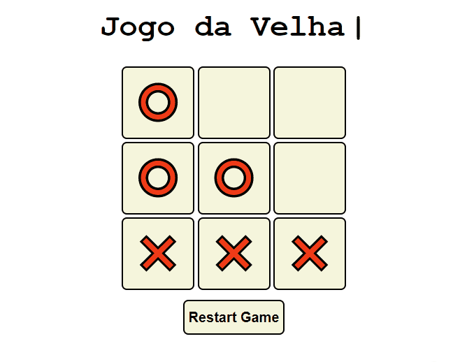

# Jogo da Velha

<h2>Descrição</h2>

Clássico Jogo da Velha, onde é necessário formar uma sequência em fila de 3 símbolos iguais para vencer.

<h2>Ilustrações</h2>

<h2>Como Jogar:</h2>

<ul>
    <li>Cada Jogador poderá fazer um click por vez.</li>
    <li>O primeiro que formar uma fila com 3 símolos iguais ganhará.</li>
    <li>Então será mostrado um alerta com uma mensagem para o vencedor.</li>
    <li>Após ou durante a partida, o jogo pode ser reiniciado apenas clicando no botão "Restart Game", localizado abaixo do layout principal.
</ul>

 

Feito com ♥ por Lucas de Lima

Visite meu <a href="https://www.linkedin.com/in/lucas-lima-880aa1206/">Linkedin</a>

